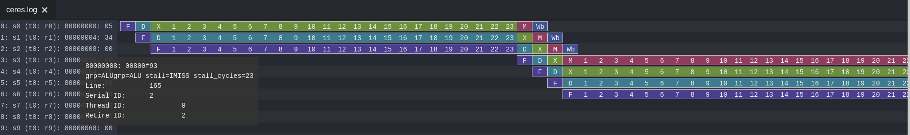
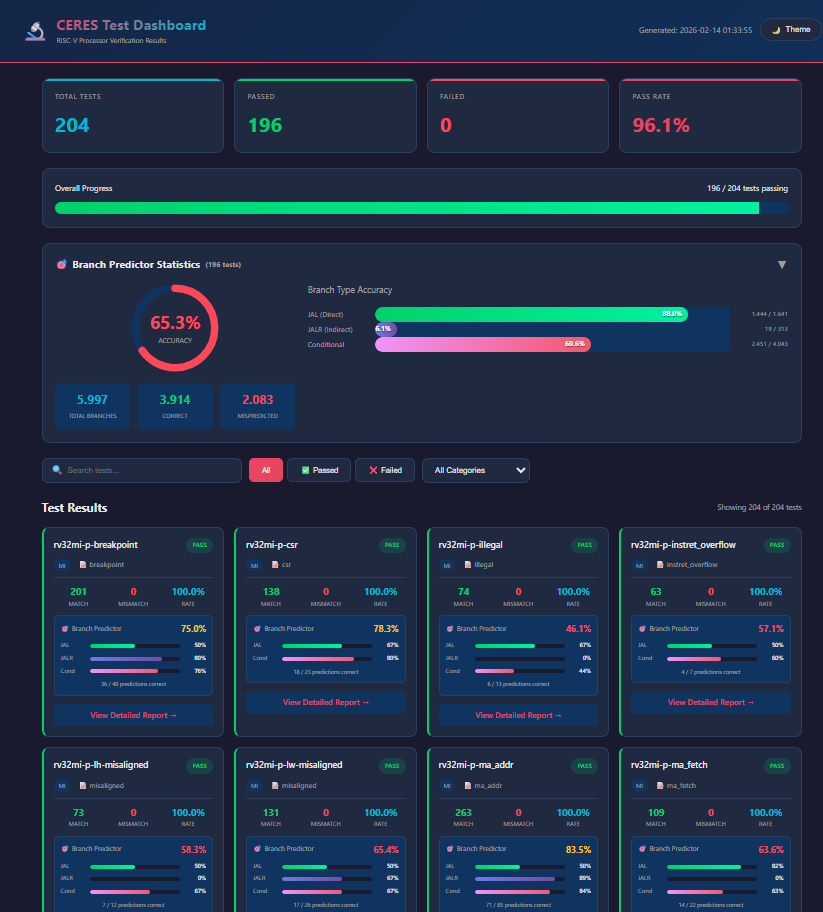

<p align="center">
  
  
  
  
</p>

# CERES RISC-V

**CERES** is a lightweight, modular, 5-stage pipelined 32-bit RISC-V processor core implementing the **RV32IMC** instruction set (Base Integer + Multiply/Divide + Compressed) with full **CSR**, **FENCE/FENCE.I**, and **Machine-mode** support. Written in **SystemVerilog (IEEE 1800-2017)**.

Designed for clarity, extensibility, and real-world deployment, suitable for learning RISC-V internals, academic research, FPGA prototyping, and embedded SoC development.

---

## Key Features

| Feature | Details |
|---------|---------|
| **ISA** | RV32I + M (Multiply/Divide) + C (Compressed) + Zicsr + Zifencei |
| **Pipeline** | 5-stage in-order (Fetch → Decode → Execute → Memory → Writeback) |
| **Branch Predictor** | Tournament (GShare + Bimodal hybrid), 512-entry PHT, 256-entry BTB, 32-entry IBTC, 16-entry RAS, Loop predictor |
| **Caches** | L1 I-Cache (8KB, 4-way) + L1 D-Cache (8KB, 4-way, write-back) + L2 Cache |
| **Hazard Handling** | Full data forwarding (MEM→EX, WB→EX, WB→DE), load-use stall detection |
| **Multiplier** | Configurable: Pipelined (2-cycle) / Wallace Tree (single-cycle) / Sequential |
| **Divider** | Configurable: Pipelined (2-bits/cycle) / Sequential (1-bit/cycle) |
| **Bus** | Wishbone B4 pipelined interface |
| **Memory Protection** | PMA (Physical Memory Attributes) |
| **Peripherals** | UART, GPIO, SPI, I2C, Timer, PLIC, PWM, DMA, WDT, VGA (10 peripherals) |
| **Verification** | 215+ tests across 7 test suites, formal verification support |
| **Trace/Debug** | Spike-compatible commit trace, Konata pipeline visualizer, branch predictor stats |

---

## Architecture Overview

```
┌──────────────────────────────────────────────────────────────────────┐
│                          CERES RISC-V Core                          │
│                                                                      │
│  ┌─────────┐  ┌─────────┐  ┌─────────┐  ┌─────────┐  ┌──────────┐ │
│  │  FETCH   │→│ DECODE   │→│ EXECUTE  │→│ MEMORY   │→│ WRITEBACK │ │
│  │          │  │          │  │          │  │          │  │          │ │
│  │• PC Mgmt │  │• Decoder │  │• ALU     │  │• Load/   │  │• Reg WB  │ │
│  │• I-Cache │  │• RegFile │  │• MUL/DIV │  │  Store   │  │• Commit  │ │
│  │• Align   │  │• Imm Gen │  │• CSR     │  │• D-Cache │  │  Trace   │ │
│  │  Buffer  │  │• Control │  │• Branch  │  │          │  │          │ │
│  │• RV32C   │  │  Unit    │  │  Resolve │  │          │  │          │ │
│  │  Decomp  │  │          │  │          │  │          │  │          │ │
│  └─────────┘  └─────────┘  └─────────┘  └─────────┘  └──────────┘ │
│       ↑                                                     │       │
│       └─────────────── Hazard Unit / Forwarding ────────────┘       │
│                                                                      │
│  ┌───────────────────────────────────────────────────────────────┐  │
│  │                   Branch Prediction Unit                       │  │
│  │  GShare (512 PHT) + Bimodal + BTB (256) + IBTC (32) + RAS    │  │
│  └───────────────────────────────────────────────────────────────┘  │
├──────────────────────────────────────────────────────────────────────┤
│                   Memory Hierarchy                                   │
│  ┌──────────┐  ┌──────────┐  ┌──────────┐  ┌─────────────────────┐ │
│  │ I-Cache  │  │ D-Cache  │  │ L2 Cache │  │ Memory Arbiter      │ │
│  │ 8KB/4-way│  │ 8KB/4-way│  │          │  │ (I$ / D$ priority)  │ │
│  └──────────┘  └──────────┘  └──────────┘  └─────────────────────┘ │
├──────────────────────────────────────────────────────────────────────┤
│                   Wishbone B4 Bus                                    │
├──────────────────────────────────────────────────────────────────────┤
│  ┌──────┐ ┌──────┐ ┌─────┐ ┌─────┐ ┌──────┐ ┌──────┐ ┌─────────┐ │
│  │ UART │ │ GPIO │ │ SPI │ │ I2C │ │Timer │ │ PLIC │ │DMA/WDT/ │ │
│  │      │ │      │ │     │ │     │ │      │ │      │ │PWM/VGA  │ │
│  └──────┘ └──────┘ └─────┘ └─────┘ └──────┘ └──────┘ └─────────┘ │
└──────────────────────────────────────────────────────────────────────┘
```

---

## Quick Start

### Prerequisites

| Tool | Version | Purpose |
|------|---------|---------|
| **Verilator** | 5.0+ | Primary RTL simulator |
| **riscv32-unknown-elf-gcc** | — | RISC-V cross-compiler toolchain |
| **Python 3** | 3.8+ | Test scripting & utilities |
| **Make** | GNU Make | Build system |
| **ModelSim** | — | *Optional:* GUI simulation & waveforms |
| **Yosys** | — | *Optional:* Synthesis |
| **GTKWave / Surfer** | — | *Optional:* Waveform viewing |

### Build & Run

```bash
# Clone the repository
git clone https://github.com/kerimturak/ceres-riscv.git
cd ceres-riscv

# Build Verilator model
make verilate

make isa_auto
make arch_auto
make imperas_auto

# Run a single ISA test
make run T=rv32ui-p-add

# Run all ISA tests
make isa

# Run CoreMark benchmark
make cm SIM_FAST=1 SIM_UART_MONITOR=1

# Clean everything
make clean
```

---

## Project Structure

```
ceres-riscv/
├── rtl/                        # RTL source files (79 HDL files)
│   ├── core/                   # Processor core
│   │   ├── cpu.sv              # Top-level CPU module
│   │   ├── hazard_unit.sv      # Pipeline hazard detection & forwarding
│   │   ├── stage01_fetch/      # IF: PC, I-Cache, Align Buffer, RV32C decoder, Branch Pred
│   │   ├── stage02_decode/     # ID: Control Unit, Register File, Immediate Extension
│   │   ├── stage03_execute/    # EX: ALU, CSR, Multiply/Divide (Wallace, Pipelined, Seq)
│   │   ├── stage04_memory/     # MEM: Data memory access, Cache logger
│   │   ├── stage05_writeback/  # WB: Register writeback, Commit trace
│   │   ├── mmu/                # Cache hierarchy (I$, D$, L2$, Memory Arbiter)
│   │   ├── bus/                # Wishbone interconnect & master bridge
│   │   └── pmp_pma/            # Physical Memory Attributes
│   ├── periph/                 # Peripherals (UART, GPIO, SPI, I2C, Timer, PLIC, PWM, DMA, WDT, VGA)
│   ├── pkg/                    # ceres_param.sv — Central configuration (1119 lines)
│   ├── include/                # Header files (.svh) — Feature flags, trace macros
│   ├── wrapper/                # Top-level SoC wrappers (Wishbone bus slaves, RAM, CLINT)
│   ├── ram/                    # Single-port BRAM
│   ├── tracer/                 # Konata pipeline visualizer
│   └── util/                   # FIFO, utilities
│
├── sim/                        # Simulation
│   ├── tb/                     # Testbenches (Verilator C++, unit TBs)
│   ├── test/                   # Test programs & lists (24 custom C tests)
│   └── do/                     # ModelSim DO scripts
│
├── env/                        # Test environments (11 environments)
│   ├── common/                 # Shared: crt.S, syscalls.c, linker scripts
│   ├── coremark/               # CoreMark configurations
│   ├── dhrystone/              # Dhrystone benchmark
│   ├── embench/                # Embench-IoT benchmark suite
│   ├── imperas/                # Imperas test environment
│   ├── riscv-arch-test/        # RISC-V Architecture Test target
│   ├── riscv-formal/           # Formal verification (RVFI wrapper)
│   └── ...
│
├── script/                     # Build & test infrastructure
│   ├── makefiles/              # Modular makefiles (25 .mk files)
│   │   ├── config/             # Build config, paths, profiles, sources, toolchain
│   │   ├── sim/                # Verilator, ModelSim, Icarus, Spike backends
│   │   ├── test/               # ISA, Arch, Imperas, CoreMark, Dhrystone, Embench...
│   │   ├── synth/              # Yosys synthesis
│   │   ├── lint/               # Linting rules
│   │   └── tools/              # Clean, help, waveform viewers
│   ├── python/                 # Python utilities (test manager, ELF conversion, analysis)
│   ├── shell/                  # Shell scripts
│   └── config/                 # JSON test configurations
│
├── subrepo/                    # External test suites (git submodules)
│   ├── riscv-tests/            # Berkeley RISC-V ISA tests
│   ├── riscv-arch-test/        # Official architecture compliance tests
│   ├── imperas-riscv-tests/    # Imperas test suite
│   ├── coremark/               # CoreMark benchmark
│   ├── embench-iot/            # Embench-IoT benchmark suite
│   ├── riscv-dv/               # RISC-V Design Verification framework
│   └── riscv-formal/           # RISC-V Formal verification
│
├── verification/               # Standalone verification testbenches
│   ├── dcache_tb/              # D-Cache comprehensive testbench
│   └── l2_cache_tb/            # L2 Cache testbench
│
├── docs/                       # Documentation (Turkish & English)
├── makefile                    # Top-level build entry point
└── PERFORMANCE.md              # CoreMark optimization guide
```

---

## Makefile Commands

The build system is organized into 25+ modular makefiles. Run `make help` for a full command listing.

### Build & Simulate

| Command | Description |
|---------|-------------|
| `make verilate` | Build Verilator C++ model |
| `make verilate-fast` | Incremental build (only if sources changed) |
| `make compile` | Compile RTL with ModelSim |
| `make simulate` | Run batch simulation (ModelSim) |
| `make simulate_gui` | Run GUI simulation with waveforms |
| `make iverilog` | Compile with Icarus Verilog |
| `make run_verilator` | Run Verilator simulation |
| `make run_icarus` | Run Icarus simulation |

### Test Suites

| Command | Description | Tests |
|---------|-------------|-------|
| `make isa` | Berkeley ISA tests (riscv-tests) | ~50 |
| `make arch` | Architecture compliance tests | ~91 |
| `make imperas` | Imperas verification tests | ~45 |
| `make bench` | Benchmark suite | 13+ |
| `make csr` | CSR-specific tests | — |
| `make all_tests` | Run ALL test suites | 215+ |

### Quick Test Shortcuts

```bash
make t T=rv32ui-p-add       # Quick ISA test
make tb T=dhrystone          # Quick benchmark
make ti T=I-ADD-01           # Quick Imperas test
make run T=<name>            # Run with RTL + Spike comparison
make quick_test T=<name>     # Run RTL only (skip Spike)
```

### Benchmarks

| Command | Description |
|---------|-------------|
| `make cm` | Build & run CoreMark |
| `make cm_run` | Run CoreMark (skip rebuild) |
| `make dhrystone` / `make dhrystone_run` | Dhrystone benchmark |
| `make embench` / `make embench_run` | Embench-IoT suite |
| `make torture` / `make torture_run` | RISC-V torture tests |
| `make riscv_dv` / `make riscv_dv_run` | RISC-V DV generated tests |
| `make formal` | Formal verification (riscv-formal) |

### Synthesis & Linting

| Command | Description |
|---------|-------------|
| `make lint` | Verilator lint check |
| `make lint-report` | Detailed lint report with stats |
| `make yosys` | Yosys synthesis |
| `make yosys_check` | Yosys structural checks |

### Utilities

| Command | Description |
|---------|-------------|
| `make clean` | Clean all build artifacts |
| `make gtkwave` | Open waveform with GTKWave |
| `make surfer` | Open waveform with Surfer |
| `make konata` | Open Konata pipeline visualizer |
| `make help` | Show help overview |
| `make help_sim` | Simulation targets |
| `make help_tests` | Test commands |
| `make help_build` | Build & synthesis targets |
| `make help_utils` | Utility commands |

### Build Modes

```bash
make verilate MODE=debug      # Full tracing, assertions ON (default)
make verilate MODE=release    # Optimized build, minimal logging
make verilate MODE=test       # RISC-V test mode with assertions
```

### Trace & Debug Options

| Flag | Description |
|------|-------------|
| `LOG_COMMIT=1` | Spike-compatible commit trace |
| `LOG_PIPELINE=1` | Konata pipeline trace file |
| `LOG_RAM=1` | RAM initialization messages |
| `LOG_UART=1` | UART TX file logging |
| `LOG_BP=1` | Branch predictor statistics |
| `LOG_BP_VERBOSE=1` | Per-branch verbose logging |
| `LOG_CACHE=1` | Cache request/response logging |
| `KONATA_TRACER=1` | Enable Konata pipeline visualizer |
| `TRACE=1` | Enable waveform tracing (.vcd/.wlf) |
| `SIM_FAST=1` | Fast mode (disable all logs) |
| `SIM_UART_MONITOR=1` | UART monitoring + auto-stop |
| `SIM_COVERAGE=1` | Enable coverage collection |
| `MAX_CYCLES=N` | Set max simulation cycles |
| `MINIMAL_SOC=1` | Reduced cache/BP for fast simulation |

#### Example Commands

```bash
# Run ISA test with commit trace for Spike comparison
make run T=rv32ui-p-add LOG_COMMIT=1

# CoreMark in fast mode with branch predictor stats
make cm SIM_FAST=1 LOG_BP=1 SIM_UART_MONITOR=1

# Pipeline visualization
make run T=rv32ui-p-add KONATA_TRACER=1 LOG_PIPELINE=1

# Waveform trace
make run T=rv32ui-p-add TRACE=1 && make surfer

# Fast simulation with minimal SoC
make verilate MINIMAL_SOC=1
make run T=rv32ui-p-add
```

### Test Type Auto-Detection

The build system automatically detects test type from the test name:

| Pattern | Detected Type | Example |
|---------|--------------|---------|
| `rv32*-p-*` | `isa` | `rv32ui-p-add` |
| `*-01`, `*-02` | `arch` | `C-ADDI-01` |
| `I-*`, `M-*`, `C-*` | `imperas` | `I-ADD-01` |
| `median`, `dhrystone`... | `bench` | `coremark` |

---

## RTL Module Reference

### Core Pipeline (17 modules)

| Stage | Module | Description |
|-------|--------|-------------|
| **Top** | `cpu` | Top-level 5-stage pipelined RV32IMC CPU |
| **Top** | `hazard_unit` | Data forwarding (4 paths), load-use stall, branch flush |
| **IF** | `fetch` | Instruction fetch with PC management |
| **IF** | `align_buffer` | Instruction alignment for compressed/uncompressed mixing |
| **IF** | `compressed_decoder` | RV32C → RV32I decompression |
| **IF** | `gshare_bp` | Tournament branch predictor (GShare + Bimodal, PHT + BTB + IBTC) |
| **IF** | `ras` | 16-entry Return Address Stack |
| **IF** | `next_line_prefetcher` | Next-line I-Cache prefetcher |
| **ID** | `decode` | Instruction decode stage |
| **ID** | `control_unit` | Instruction decoder / control signal generation |
| **ID** | `extend` | Immediate extension unit |
| **ID** | `reg_file` | 32-entry integer register file |
| **EX** | `execution` | Execute stage top-level |
| **EX** | `alu` | Arithmetic/Logic Unit |
| **EX** | `cs_reg_file` | Machine-mode CSR register file |
| **MEM** | `memory` | Data memory access stage |
| **WB** | `writeback` | Register writeback + commit trace |

### Multiply/Divide (configurable via feature flags)

| Module | Type | Latency |
|--------|------|---------|
| `mul_pipelined` | Pipelined (4×8x32 decomposition) | 2 cycles |
| `mul_int` | Sequential (shift-and-add) | 32 cycles |
| Wallace Tree (`wallace32x32/`) | Combinational | 1 cycle |
| `divu_pipelined` | Pipelined (2 bits/cycle) | ~16 cycles |
| `divu_int` | Sequential (1 bit/cycle) | ~32 cycles |

### Cache Hierarchy (6 modules)

| Module | Description |
|--------|-------------|
| `icache` | L1 Instruction Cache (8KB, 4-way set assoc, PLRU) |
| `dcache` | L1 Data Cache (8KB, 4-way, write-back, dirty bits, PLRU) |
| `dcache_fencei` | FENCE.I dirty writeback support |
| `l2_cache` | Unified L2 Cache |
| `memory_arbiter` | I-Cache / D-Cache bus arbitration |
| `cache` | Unified cache wrapper |

### Peripherals (10 peripherals, 17 files)

| Peripheral | Address | Description |
|------------|---------|-------------|
| **UART** (×2) | `0x2000_0000` | UART controller with TX/RX FIFOs (115200 baud) |
| **SPI** | `0x2000_2000` | SPI master controller |
| **I2C** | `0x2000_3000` | I2C master (+ simulation slave) |
| **GPIO** | `0x2000_4000` | 32-bit GPIO controller |
| **PWM** | `0x2000_5000` | PWM controller |
| **Timer** | `0x2000_6000` | General-purpose timer |
| **PLIC** | `0x2000_7000` | Platform-Level Interrupt Controller (16 ext IRQs) |
| **WDT** | `0x2000_8000` | Watchdog timer |
| **DMA** | `0x2000_9000` | DMA controller |
| **VGA** | `0x2000_D000` | VGA controller with character ROM |

### Memory Map

| Region | Base Address | End Address | Description |
|--------|-------------|-------------|-------------|
| DEBUG | `0x0000_0000` | — | Debug module |
| BOOTROM | `0x1000_0000` | — | Boot ROM |
| PERIPH | `0x2000_0000` | `0x2000_FFFF` | Peripheral bus (see above) |
| CLINT | `0x3000_0000` | — | Core-Local Interruptor (mtime, mtimecmp) |
| EXTMEM | `0x4000_0000` | — | External memory |
| **RAM** | `0x8000_0000` | — | Main RAM (reset vector, 32KB default) |

---

## Configuration

All core parameters are centralized in `rtl/pkg/ceres_param.sv` (1119 lines). Key parameters:

| Parameter | Full SoC | Minimal SoC |
|-----------|----------|-------------|
| Clock | 25 MHz | 25 MHz |
| I-Cache | 8KB, 4-way | 2KB, 2-way |
| D-Cache | 8KB, 4-way | 2KB, 2-way |
| PHT entries | 512 | 64 |
| BTB entries | 256 | 32 |
| GHR bits | 24 | 8 |
| RAS depth | 16 | 8 |
| Block size | 128 bits | 128 bits |
| RAM size | 32 KB | 32 KB |

### Feature Flags (`rtl/include/ceres_defines.svh`)

```systemverilog
`define FEAT_PIPELINED_MUL   // Pipelined 2-cycle multiplier (default)
`define FEAT_PIPELINED_DIV   // Pipelined 2-bits/cycle divider (default)
// `define FEAT_WALLACE_SINGLE // Single-cycle Wallace tree multiplier
// `define MINIMAL_SOC        // Reduced caches & BP for fast simulation
// `define SYNTHESIS          // FPGA synthesis mode (implies MINIMAL_SOC)
```

---

## Verification & Testing

### Test Suites

| Suite | Source | Count | Description |
|-------|--------|-------|-------------|
| **riscv-tests** | Berkeley | ~50 | ISA compliance (RV32I/M/C) |
| **riscv-arch-test** | RISC-V International | ~91 | Architecture compliance |
| **Imperas** | Imperas | ~45 | Comprehensive instruction tests |
| **CoreMark** | EEMBC | 1 | Industry-standard CPU benchmark |
| **Dhrystone** | — | 1 | Classic integer benchmark |
| **Embench-IoT** | — | 13+ | Embedded benchmark suite |
| **riscv-formal** | — | — | Formal verification (RVFI) |
| **riscv-dv** | Google | — | Random instruction generation |
| **Torture** | — | — | Random stress tests |

### Custom Test Programs (24 tests in `sim/test/custom/`)

Peripheral and feature tests written in C: `arithmetic`, `branch`, `cache`, `csr`, `exception`, `fibonacci`, `memory`, `interrupt`, `clint`, `dma`, `gpio`, `i2c`, `plic`, `pwm`, `spi`, `timer`, `uart`, `vga`, `wdt`, and more.

### Running Tests

```bash
# Individual test
make run T=rv32ui-p-add

# All ISA tests with commit logging
make isa LOG_COMMIT=1

# Architecture test
make run T=C-ADDI-01

# Full regression
make all_tests

# CoreMark with performance stats
make cm SIM_FAST=1 LOG_BP=1 SIM_UART_MONITOR=1
```

### Test Infrastructure — Makefile Modules

The test system is powered by **13 modular makefiles** under `script/makefiles/test/`, each responsible for a specific test suite or capability:

| Makefile | Targets | Description |
|----------|---------|-------------|
| `run_test.mk` | `run`, `run_flist`, `dashboard` | **Core test runner** — single test, batch execution, HTML dashboard |
| `test_lists.mk` | `isa`, `arch`, `imperas`, `csr`, `bench`, `all_tests` | Shortcut targets for running full test suites |
| `isa_import.mk` | `isa_auto`, `isa_clone`, `isa_build`, `isa_import` | Berkeley riscv-tests: clone, compile, import ELF/MEM/DUMP |
| `arch_test.mk` | `arch_auto`, `arch_clone`, `arch_build`, `arch_import` | RISC-V architecture compliance tests (direct compilation, no RISCOF) |
| `imperas_test.mk` | `imperas_auto`, `imperas_clone`, `imperas_build`, `imperas_import` | Imperas RISC-V verification tests (RV32I base) |
| `coremark.mk` | `cm`, `cm_run`, `coremark`, `coremark_help` | CoreMark benchmark build & run |
| `coremark_spike.mk` | `cm_spike`, `cm_compare` | CoreMark on CERES + Spike for comparison |
| `coremark_minimal.mk` | `cm_minimal`, `cm_minimal_quick` | Minimal CoreMark port (no UART, CSR-based timing) |
| `dhrystone.mk` | `dhrystone`, `dhrystone_run`, `dhrystone_help` | Classic Dhrystone integer benchmark |
| `embench.mk` | `embench`, `embench_run`, `embench_report` | Embench-IoT embedded benchmark suite |
| `torture.mk` | `torture`, `torture_gen`, `torture_run`, `torture_batch` | Random instruction stress test generator |
| `riscv_dv.mk` | `riscv_dv`, `riscv_dv_gen`, `riscv_dv_run` | Google's UVM-based random instruction generator |
| `riscv_formal.mk` | `formal`, `formal_bmc`, `formal_prove`, `formal_cover` | Formal verification with SymbiYosys + riscv-formal |

Each `*_auto` target provides a **one-command pipeline**: clone → configure → build → import. For example:

```bash
make isa_auto       # Clone riscv-tests, compile all RV32IMC tests, import binaries
make arch_auto      # Clone riscv-arch-test, compile compliance tests, import
make imperas_auto   # Clone Imperas tests, compile, import
```

### HTML Test Dashboard

After running test suites, you can generate an **interactive HTML dashboard** that aggregates all test results into a single page:

```bash
# Run tests first
make isa
make arch

# Generate the dashboard
make dashboard

# Open in browser
make open_dashboard
# or manually:
xdg-open results/logs/dashboard.html
```

The dashboard (`script/python/makefile/generate_test_dashboard.py`) scans every test directory under `results/logs/verilator/`, parses `diff.log`, `summary.json`, and `bp_stats.log` for each test, and generates a self-contained HTML file with:

- **Summary cards** — total tests, passed, failed, pass rate
- **Test grouping** — tests categorized by ISA extension (ui, um, uc, mi, arch, imperas...)
- **Per-test details** — match rate, mismatch count, branch predictor accuracy
- **Search & filter** — real-time filtering by test name or status
- **Dark/Light theme** — toggle between themes
- **Navigation links** — click any test to jump to its individual `diff.html` report

```bash
make dashboard                           # Default: verilator results
make dashboard SIM=modelsim              # ModelSim results
make dashboard DASHBOARD_TITLE="Nightly" # Custom title
```

---

## Simulation Tools

| Simulator | Command | Use Case |
|-----------|---------|----------|
| **Verilator** | `make verilate` + `make run T=...` | Primary — fast C++ simulation |
| **ModelSim** | `make compile` + `make simulate_gui` | GUI waveform debugging |
| **Icarus Verilog** | `make iverilog` + `make run_icarus` | Open-source alternative |
| **Spike** | (integrated) | ISA reference for commit trace comparison |

### Waveform & Visualization

```bash
make surfer                  # Open Surfer waveform viewer
make gtkwave                 # Open GTKWave
make konata                  # Konata pipeline visualizer
```

---

## Documentation

| Document | Description |
|----------|-------------|
| [Architecture](docs/architecture.md) | Full architecture design document |
| [Getting Started](docs/getting-started.md) | Setup and first run guide |
| [Tools Guide](docs/tools.md) | Development tools reference |
| [SoC Roadmap](docs/soc-roadmap.md) | Future SoC development plans |
| [FENCE.I Implementation](docs/fence-i-implementation.md) | FENCE.I cache coherence details |
| [Exception Priority](docs/parametric-exception-priority.md) | Parametric exception handling system |
| [Cache Configuration](docs/CACHE_CONFIG_README.md) | Cache parameter tuning guide |
| [CoreMark Guide](docs/COREMARK_QUICK_START.md) | CoreMark build & run guide |
| [Extended Test Suites](docs/extended-test-suites.md) | Test suite integration documentation |
| [Wishbone Bus](docs/wishbone-bus.md) | Bus interface specification |

---

## Performance

**CoreMark Score: 2.16 CoreMark/MHz** (at 25 MHz)

See [PERFORMANCE.md](PERFORMANCE.md) for detailed optimization analysis including branch predictor tuning, cache configuration, and multiplier selection strategies.

---

## Build & Results Directory Layout

All compilation artifacts, test binaries, and simulation results are organized under two top-level directories:

### `build/` — Compilation Artifacts & Test Binaries

```
build/
├── obj_dir/                    # Verilator compiled model
│   ├── Vceres_wrapper          # Simulation executable binary
│   ├── Vceres_wrapper.mk       # Verilator-generated Makefile
│   ├── Vceres_wrapper*.cpp/h   # Generated C++ model sources
│   └── tb_wrapper.o            # Compiled testbench object
│
├── tests/                      # Compiled test binaries (per suite)
│   ├── riscv-tests/            # Berkeley ISA tests
│   │   ├── elf/                # ELF executables (rv32ui-p-add, rv32um-p-mul, ...)
│   │   ├── hex/                # 32-bit hex files (.hex) for Verilog $readmemh
│   │   ├── mem/                # 128-bit memory image files (.mem) for cache-line loading
│   │   ├── dump/               # Disassembly listings (.dump)
│   │   └── pass_fail_addr/     # Pass/fail address pairs (_addr.txt)
│   ├── riscv-arch-test/        # Architecture compliance tests (same structure + reference/)
│   └── imperas/                # Imperas tests (same structure + reference/)
│
├── logs/                       # Simulation logs (temporary)
├── temp/                       # Intermediate build files
└── work/                       # ModelSim work library
```

**File format examples:**

| File Type | Example | Content |
|-----------|---------|---------|
| **ELF** | `rv32ui-p-add` | RISC-V ELF32 executable, loaded by Spike |
| **Dump** | `rv32ui-p-add.dump` | `objdump` disassembly for debugging |
| **Hex** | `rv32ui-p-add.hex` | `@80000000` address-annotated byte hex |
| **Mem** | `rv32ui-p-add.mem` | 32-bit word-per-line hex for `$readmemh` |
| **Addr** | `rv32ui-p-add_addr.txt` | `0x800005fc 0x800005e0` (pass addr, fail addr) |

<details>
<summary><b>Example: Dump file (rv32ui-p-add.dump)</b></summary>

```
rv32ui-p-add:     file format elf32-littleriscv

Disassembly of section .text.init:

80000000 <_start>:
80000000:       0500006f                j       80000050 <reset_vector>

80000004 <trap_vector>:
80000004:       34202f73                csrr    t5,mcause
80000008:       00800f93                li      t6,8
```
</details>

<details>
<summary><b>Example: Mem file (rv32ui-p-add.mem)</b></summary>

```
0500006f
34202f73
00800f93
03ff0863
00900f93
03ff0463
```
</details>

### `results/` — Test Results & Regression Reports

```
results/
├── logs/
│   ├── tests_passed.list       # All passing test names
│   ├── tests_failed.list       # All failing test names
│   ├── verilator/              # Per-test result directories (Verilator)
│   │   ├── rv32ui-p-add/
│   │   │   ├── summary.json        # Test metadata (exit code, timing, config)
│   │   │   ├── test_report.txt     # Pass/fail verdict (RTL + Spike comparison)
│   │   │   ├── commit_trace.log    # Spike-compatible instruction trace
│   │   │   ├── spike_commit.log    # Spike reference trace
│   │   │   ├── diff.log            # Trace comparison diff
│   │   │   ├── bp_stats.log        # Branch predictor statistics
│   │   │   ├── ceres.log           # RTL simulation log
│   │   │   ├── uart_output.log     # UART TX output capture
│   │   │   ├── verilator_run.log   # Verilator stdout/stderr
│   │   │   └── waveform.fst        # FST waveform trace (when TRACE=1)
│   │   ├── C-ADDI-01/
│   │   ├── I-ADD-01/
│   │   └── ...                 # One directory per test
│   ├── modelsim/               # ModelSim results (same structure)
│   └── default_simulator/      # Default simulator results
│
└── regression/
    ├── latest_summary.txt      # Latest regression summary
    ├── report_YYYYMMDD_HHMMSS.txt  # Timestamped regression reports
    ├── reg_isa.log             # ISA suite regression log
    ├── reg_arch.log            # Architecture suite regression log
    ├── reg_imperas.log         # Imperas suite regression log
    └── reg_csr.log             # CSR suite regression log
```

**Key result files explained:**

<details>
<summary><b>Example: summary.json</b></summary>

```json
{
  "test": "rv32ui-p-add",
  "simulator": "verilator",
  "exit_code": 0,
  "max_cycles": 10000,
  "elapsed_seconds": 0.1,
  "timestamp": "2026-02-14T01:00:56.637354",
  "settings": {
    "trace_enabled": true,
    "trace_format": "fst",
    "coverage_enabled": true
  }
}
```
</details>

<details>
<summary><b>Example: test_report.txt</b></summary>

```
RTL_EXIT_CODE=0
SPIKE_EXIT_CODE=0

=== Results ===
RTL_SUCCESS=True
SPIKE_SUCCESS=True
COMPARE_SUCCESS=True
OVERALL_SUCCESS=True
```
</details>

<details>
<summary><b>Example: commit_trace.log (Spike-compatible format)</b></summary>

```
core   0: 3 0x80000000 (0x0500006f)
core   0: 3 0x80000050 (0x00000093) x1  0x00000000
core   0: 3 0x80000054 (0x00000113) x2  0x00000000
```
</details>

<details>
<summary><b>Example: bp_stats.log (Branch Predictor Statistics)</b></summary>

```
╔══════════════════════════════════════════════════════════════╗
║          GSHARE Branch Predictor - Final Statistics          ║
╠══════════════════════════════════════════════════════════════╣
║  Total Control Transfers :         71                        ║
║  Correct Predictions     :         52  ( 73.24%)             ║
║  Mispredictions          :         19  ( 26.76%)             ║
╚══════════════════════════════════════════════════════════════╝
```
</details>

<details>
<summary><b>Example: latest_summary.txt (Regression Report)</b></summary>

```
CERES RISC-V Regression Report
Date: Sat Feb 14 01:00:54 +03 2026
============================================
ISA: 51 passed, 0 failed
ARCH: 84 passed, 7 failed
IMPERAS: 45 passed, 0 failed
CSR: 16 passed, 0 failed
============================================
TOTAL: 196 passed, 7 failed
Duration: 164s
```
</details>

### Detailed Trace & Debug Logs

Every test run produces a rich set of log files under `results/logs/verilator/<test_name>/`. These logs form a comprehensive debugging toolkit — from instruction-level trace comparison to pipeline visualization.

#### Log File Reference

| File | Purpose |
|------|---------|
| `commit_trace.log` | CERES RTL instruction commit trace (Spike-compatible format) |
| `spike_commit.log` | Spike ISA simulator reference trace |
| `diff.log` | Raw diff between RTL and Spike traces |
| `diff_visual_diff.log` | **Visual side-by-side comparison** with per-instruction MATCH/MISMATCH markers |
| `diff.html` | **Interactive HTML diff viewer** (dark/light theme, search, filtering) |
| `bp_stats.log` | Branch predictor accuracy statistics (hit rates, misprediction breakdown) |
| `ceres.log` | **Konata pipeline trace** — cycle-accurate instruction lifecycle log |
| `summary.json` | Machine-readable test metadata (exit code, timing, config) |
| `test_report.txt` | Final pass/fail verdict (RTL, Spike, comparison results) |
| `uart_output.log` | Captured UART TX output during simulation |
| `verilator_run.log` | Raw Verilator simulator stdout/stderr |
| `waveform.fst` | FST waveform file (generated when `TRACE=1`) |

#### Visual Diff — `diff_visual_diff.log`

The visual diff shows every committed instruction side-by-side between CERES and Spike, with per-line match status:

```
╔════════════════════════════════════════════════════════════════════════════╗
║                         CERES vs SPIKE VISUAL DIFF                        ║
╚════════════════════════════════════════════════════════════════════════════╝

✅ MATCH | PC=0x80000000 INST=0x0500006f              | PC=0x80000000 INST=0x0500006f
✅ MATCH | PC=0x80000050 INST=0x00000093 x1 0x00000000 | PC=0x80000050 INST=0x00000093 x1 0x00000000
✅ MATCH | PC=0x800000d8 INST=0x30529073 c773_mtvec 0x80000004 | PC=0x800000d8 INST=0x30529073 ...
❌ MISMATCH | ...                                       | ...
```

Any mismatch between CERES and Spike is immediately visible, showing the exact PC, instruction, and register write where behavior diverges.

#### Interactive HTML Diff — `diff.html`

Open `diff.html` in any browser to get a fully interactive comparison view:

- **Dark/Light theme** toggle
- **Search & filter** by PC address, instruction, or register
- **Color-coded** results: green (match), red (mismatch)
- **Summary statistics** (total instructions, match rate)
- Styled with `JetBrains Mono` for readability

```bash
# Open the HTML diff after running a test
make run T=rv32ui-p-add LOG_COMMIT=1
xdg-open results/logs/verilator/rv32ui-p-add/diff.html
```

#### Konata Pipeline Visualization — `ceres.log`



CERES includes a built-in **Konata logger** (`rtl/tracer/konata_logger.sv`) that generates cycle-accurate pipeline trace files. Every instruction's journey through the pipeline stages is recorded:

```
I   0   0   0                          ← Instruction #0 issued
L   0   0   80000000: 0500006f         ← Label: PC and encoded instruction
L   0   1   grp=JUMP                   ← Instruction group (JUMP, ALU, CSR, MEM...)
S   0   0   F                          ← Stage transition: enters Fetch
S   0   0   D                          ← Stage transition: enters Decode
S   0   0   X                          ← Stage transition: enters Execute
R   0   0   0                          ← Instruction retires (commits)
```

Each instruction is tracked with:
- **I** (Issue) — instruction enters the pipeline
- **L** (Label) — annotation with PC, encoding, and instruction group
- **S** (Stage) — stage transitions: **F**(etch) → **D**(ecode) → **X**(execute) → **M**(emory) → **W**(riteback)
- **E** (End stage) — leaves a pipeline stage
- **R** (Retire) — instruction commits and exits the pipeline

Open the trace with [**Konata**](https://github.com/shioyadan/Konata) to get a visual pipeline diagram:

```bash
# Generate pipeline trace and open in Konata
make run T=rv32ui-p-add KONATA_TRACER=1 LOG_PIPELINE=1
make konata   # Opens Konata with the latest trace
```

This allows you to visually inspect pipeline bubbles, stalls, flushes from branch mispredictions, and cache miss penalties at the instruction level.

## Generating Dashboard

You can generate enhanced HTML report for all test

```bash
make dashboard
```



---

## Scores

```
=================================
CoreMark on Ceres-V RV32IMC_Zicsr
=================================
CPU Clock: 25000000 Hz
UART Baud: 115200

▒K performance run parameters for coremark.
CoreMark Size    : 666
Total ticks      : 934769150
Total time (secs): 37
Iterations/Sec   : 54
Iterations       : 2000
Compiler version : GCC15.1.0
Compiler flags   : -O2 -g -march=rv32imc_zicsr -mabi=ilp32 -fno-builtin -fno-common -nostdlib -nostartfiles -DPERFORMANCE_RUN=1 -DPERFORMANCE_RUN=1  -lm -lgcc
Memory location  : STACK
seedcrc          : 0xe9f5
[0]crclist       : 0xe714
[0]crcmatrix     : 0x1fd7
[0]crcstate      : 0x8e3a
[0]crcfinal      : 0x4983
Correct operation validated. See README.md for run and reporting rules.

=================================
CoreMark Complete!
=================================
```
---

## Contributing

1. Fork the repository
2. Create a feature branch (`git checkout -b feature/my-feature`)
3. Follow the coding conventions:
   - Module naming: `lowercase_with_underscores`
   - Signal prefixes: `i_` (input), `o_` (output), `_n` (active-low)
   - Always import `ceres_param::*` for parameters
   - One module per file, filename matches module name
4. Run `make lint` before committing
5. Submit a pull request

---

## License

This project is licensed under the **GNU General Public License v3.0** — see the [LICENSE](LICENSE) file for details.

---

## Author

**Kerim Turak**

---

<p align="center">
  <i>CERES — A clean, well-documented RISC-V core for learning and building.</i>
</p>
