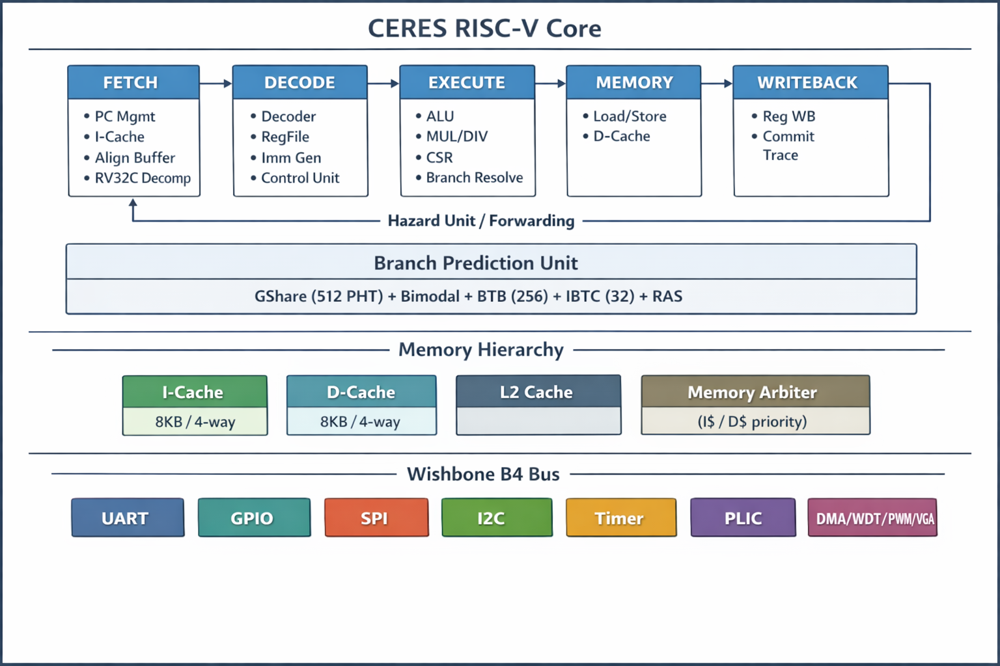
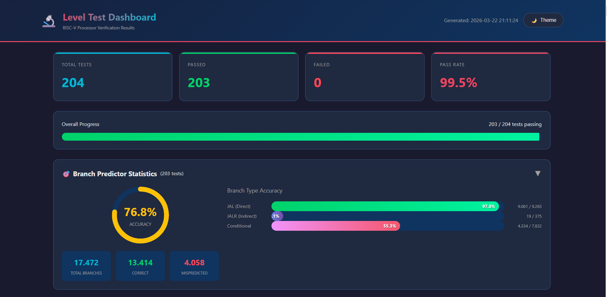
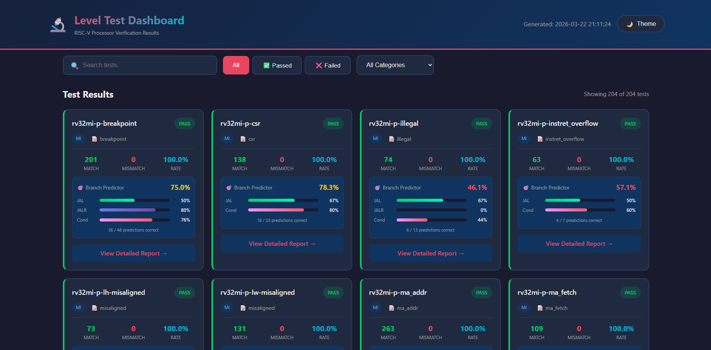
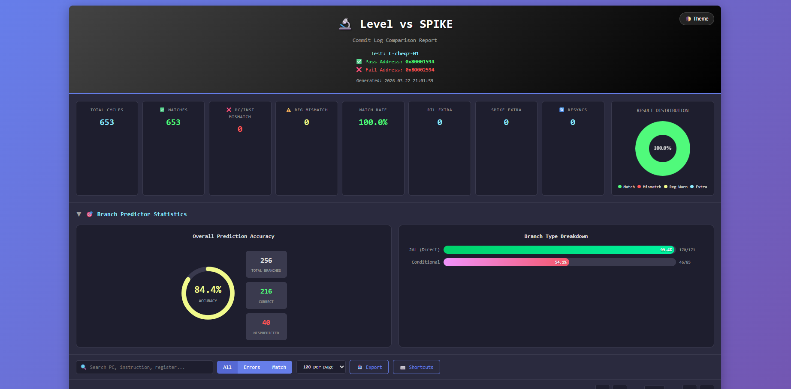
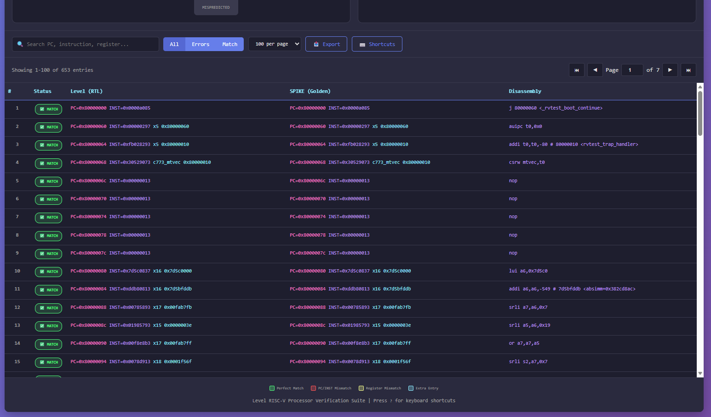
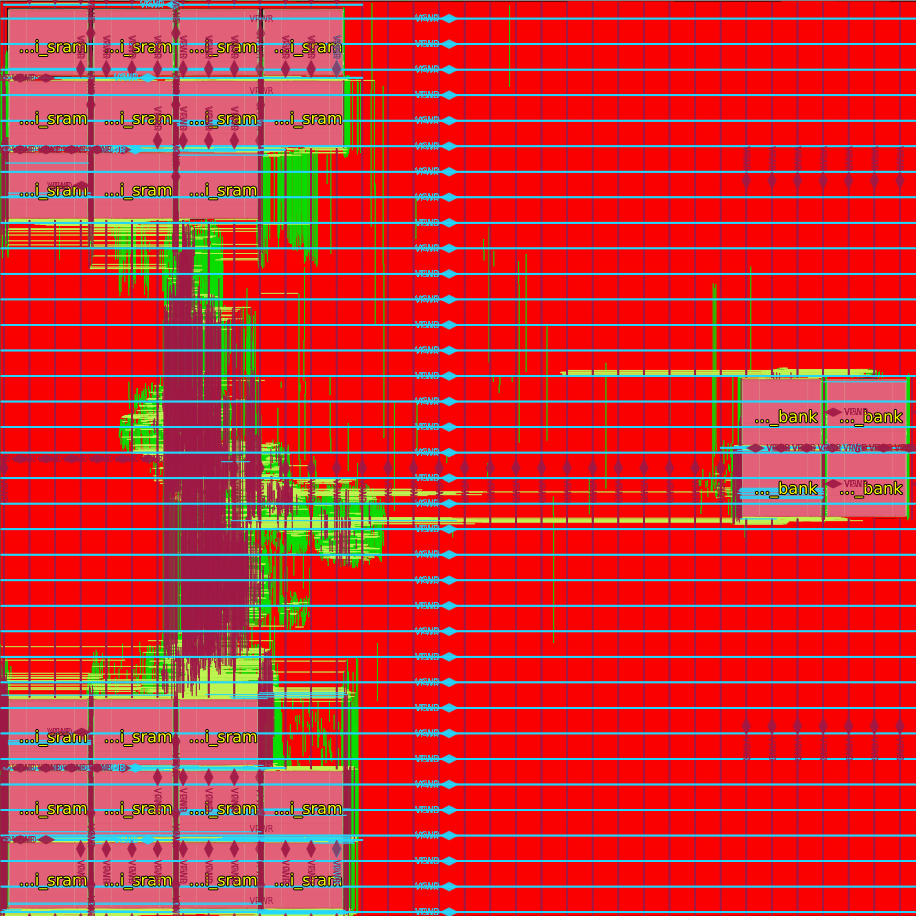

<p align="center">
  
  
  
  
  <br/><br/>
  <a href="https://kerimturak.github.io/level-v/"></a>
  <a href="https://github.com/kerimturak/level-v"></a>
</p>

# Level RISC-V

A **5-stage in-order RV32IMC** RISC-V core in **SystemVerilog**, with CSR / machine mode, caches, Wishbone, and a small SoC (UART, GPIO, SPI, I2C, timers, PLIC, and more). Built for learning, research, FPGA bring-up, and flow automation—not a minimal toy core.

<p align="center">
  
</p>

---

## Project status

RTL simulation, verification, and benchmark harnesses remain usable, but **downstream work is on hold: there is no FPGA board in hand**, so bitstream bring-up, in-system measurement, and the **FPGA column in the score table** are not being filled yet. Resume when hardware and a stable Vivado (or other) flow are available.

---

## Highlights

| Area | What you get |
|------|----------------|
| **ISA** | RV32I + M + C, Zicsr, Zifencei, machine mode |
| **Frontend** | Align buffer, RV32C decode, tournament branch predictor (GShare + bimodal), BTB, RAS, optional **next-line prefetch** (`PREFETCH_TYPE` in `level_param.sv`) |
| **Memory** | **L1** I$/D$ + PMA; optional **L2** — non-blocking, **dual-pipe** (I & D), **multi-bank**, write-back, MSHR, MESI-style tags (`USE_L2_CACHE=1`) |
| **Execute** | ALU, CSR file, selectable multiply/divide implementations |
| **Verify** | riscv-tests, riscv-arch-test, Imperas flows, Spike trace compare, optional formal / RISC-V DV |
| **Observability** | Spike-style commit trace, Konata pipeline export, **HTML test dashboard** (`make dashboard`) |

### Memory hierarchy (detail)

| Block | Role |
|--------|------|
| **L1 I$ / D$** | Blocking line fills toward L2 or main memory; sizes and associativity from `rtl/pkg/level_param.sv`. |
| **L2 `nbmbmp_l2_cache`** | *Non-blocking, multi-bank, multi-port* cache: separate **I-pipe** and **D-pipe** FSMs, `dp_bram` arrays per way/bank, shared memory controller, inline **MSHR** for concurrent misses, write-back evictions to Wishbone. Turn on with **`USE_L2_CACHE=1`** for sim/synth defines. |
| **Prefetch** | **`next_line_prefetcher`** + **`prefetcher_wrapper`** in the fetch path; arms the line after a demand miss and refills through the same I$ → L2 port. Default **`PREFETCH_TYPE = 0`** (off); set to `1` for next-line mode. |

### Test dashboard

After runs under `results/logs/<sim>/`, **`make dashboard`** builds a browsable HTML report (pass/fail, diff stats, grouping by test family). Illustrative preview:

<p align="center">
  
  
  
  
  <br/>
  <sub>Stylized preview — open the generated <code>index.html</code> after <code>make dashboard</code> for live data.</sub>
</p>

---

## Open-source tool stack

Tools this repo integrates with day to day. Click a badge to open the upstream project where applicable.

<table>
  <thead>
    <tr>
      <th width="200"></th>
      <th>Tool</th>
      <th>Role in Level</th>
    </tr>
  </thead>
  <tbody>
    <tr>
      <td align="center"><a href="https://en.wikipedia.org/wiki/RISC-V"></a></td>
      <td><strong>RISC-V ISA</strong></td>
      <td>Instruction set & compliance references</td>
    </tr>
    <tr>
      <td align="center"><a href="https://verilator.org"></a></td>
      <td><strong>Verilator</strong></td>
      <td>Primary fast RTL simulation (C++ model)</td>
    </tr>
    <tr>
      <td align="center"><a href="https://www.python.org/"></a></td>
      <td><strong>Python 3</strong></td>
      <td>Test runner, ELF/MEM helpers, dashboards, config tooling</td>
    </tr>
    <tr>
      <td align="center"></td>
      <td><strong>GNU Make</strong></td>
      <td>Single root <code>makefile</code> orchestrates sim, tests, synth helpers</td>
    </tr>
    <tr>
      <td align="center"></td>
      <td><strong>RISC-V GCC</strong> <code>riscv32-unknown-elf-</code></td>
      <td>Compiles ISA / benchmark / custom C tests</td>
    </tr>
    <tr>
      <td align="center"><a href="https://github.com/riscv-software-src/riscv-isa-sim"></a></td>
      <td><strong>Spike</strong></td>
      <td>Golden reference for commit-trace comparison</td>
    </tr>
    <tr>
      <td align="center"><a href="https://yosyshq.net/yosys/"></a></td>
      <td><strong>Yosys</strong></td>
      <td>Lint / synthesis / structural checks (<code>make yosys</code>, <code>make lint</code>)</td>
    </tr>
    <tr>
      <td align="center"></td>
      <td><strong>ModelSim / Questa</strong></td>
      <td>Optional event-driven sim + GUI waves</td>
    </tr>
    <tr>
      <td align="center"><a href="https://gtkwave.sourceforge.net/"></a></td>
      <td><strong>GTKWave / Surfer</strong></td>
      <td>View FST/VCD from Verilator or ModelSim</td>
    </tr>
    <tr>
      <td align="center"><a href="https://github.com/shioyadan/Konata"></a></td>
      <td><strong>Konata</strong></td>
      <td>Pipeline trace viewer (Konata logger in RTL)</td>
    </tr>
    <tr>
      <td align="center"><a href="https://github.com/chipsalliance/riscv-dv"></a></td>
      <td><strong>riscv-dv</strong></td>
      <td>Optional random ISA stimulus (<code>make riscv_dv_*</code>)</td>
    </tr>
    <tr>
      <td align="center"><a href="https://github.com/SymbioticEDA/riscv-formal"></a></td>
      <td><strong>riscv-formal</strong></td>
      <td>Optional bounded / formal checks (<code>make formal*</code>)</td>
    </tr>
  </tbody>
</table>

---

## Quick start

**Prerequisites:** Verilator 5+, RISC-V GCC (`riscv32-unknown-elf-*`), Python 3.8+, GNU Make. Optional: Spike, Yosys, ModelSim, GTKWave/Surfer.

```bash
git clone https://github.com/kerimturak/level-v.git
cd level-v

# Build the Verilator model
make verilate

# One-shot: fetch + build + import Berkeley ISA tests (needs subrepo / toolchain)
make isa_auto

# Run one test (RTL + Spike compare by default)
make run T=rv32ui-p-add

# Run the ISA regression suite
make isa

# Help
make help
```

**Useful shortcuts:** `make t T=<isa-test>`, `make run T=<name>`, `make quick_test T=<name>` (RTL only). See `make help_tests` and `make help_sim`.

---

## Repository layout (short)

```
├── rtl/                 # Core, MMU/cache, peripherals, wrappers, pkg, flist.f
├── sim/                 # C++ TB, test lists, custom C tests
├── env/                 # Per-test link scripts & runtime for each suite
├── script/              # Python tools, shell helpers, JSON/.conf profiles
├── subrepo/             # riscv-tests, riscv-arch-test, Imperas, CoreMark, …
├── docs/                # Deep-dive markdown + MkDocs site source
├── makefile             # Single entry point for sim, tests, synth helpers
└── results/             # Logs, waves, dashboards (generated)
```

---

## Common Make targets

| Target | What it does |
|--------|----------------|
| `make verilate` | Compile RTL → `build/obj_dir/Vlevel_wrapper` |
| `make verilate-fast` | Same as `make verilate VERILATE_FAST=1` (dev skip heuristic) |
| `make run T=<test>` | Full flow: prep → RTL → Spike → compare (see `USE_PYTHON`) |
| `make isa` / `make arch` / `make imperas` | Batch suites (requires imported ELFs under `build/tests/`) |
| `make isa_auto` / `make arch_auto` | Clone/configure/build/import pipelines |
| `make run_coremark` | CoreMark path (see `docs/COREMARK_QUICK_START.md`) |
| `make lint` | Verilator `--lint-only` pass |
| `make dashboard` | HTML summary over `results/logs/<sim>/` |
| `make clean` | Clears build artifacts; keeps `build/tests/` by default |
| `make clean_nuclear` | Deletes all of `build/` including compiled tests |

**Configuration:** simulator JSON under `script/config/verilator.json` & `modelsim.json`; simulation profile keys in `script/config/tests/*.conf` (merged with `default.conf`). Override with `TEST_CONFIG=...`, `MAX_CYCLES=...`, etc.

---

## Documentation

**Site:** [kerimturak.github.io/level-v](https://kerimturak.github.io/level-v/) — architecture, tools, sim guides, cache tuning, exception priority, Wishbone, and more.

**Local:** `mkdocs serve` if you use MkDocs, or browse `docs/` directly. Highlights:

| Topic | Entry |
|--------|--------|
| Architecture | [docs/architecture.md](docs/architecture.md) |
| Tools | [docs/tools.md](docs/tools.md) |
| Simulation overview | [docs/sim/overview.md](docs/sim/overview.md) |
| CoreMark | [docs/COREMARK_QUICK_START.md](docs/COREMARK_QUICK_START.md) |
| Performance tuning | [PERFORMANCE.md](PERFORMANCE.md) |

---

## ASIC / OpenLane

OpenLane flow assets live under `asic/openlane/`. Example GDS snapshot:

<p align="center">
  
</p>

---

## Benchmark scores

Fill in after locked configuration (RTL profile, compiler flags, clock). For methodology and simulation-oriented tuning notes, see [PERFORMANCE.md](PERFORMANCE.md).

| Benchmark | Metric | Verilator / RTL sim | FPGA (target board) | Notes |
| --------- | -------------------------------------- | ------------------- | ------------------- | ---------------------------------------- |
| CoreMark | CoreMark/MHz | | | e.g. iterations & linker match FPGA RAM |
| CoreMark | Total CoreMarks @ Fclk | | | |
| Dhrystone | Dhrystones/s | | | |
| Dhrystone | DMIPS/MHz | | | |
| Embench | Normalized score (geomean) | | | Host-side geomean from per-bench metrics |
| Embench | Per-bench `EMBENCH_MCYCLES` (optional) | | | UART / log aggregate |

---

## Contributing

1. Fork and branch from `main`.
2. Match RTL style: one module per file, `level_param` parameters, consistent `*_i` / `*_o` suffixes.
3. Run `make lint` before opening a PR.

---

## License

**GPLv3** — see [LICENSE](LICENSE).

---

## Author

**Kerim Turak**

<p align="center"><i>Level — a documented RV32IMC core for simulation, verification, and SoC experiments.</i></p>
