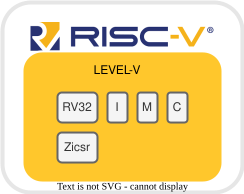
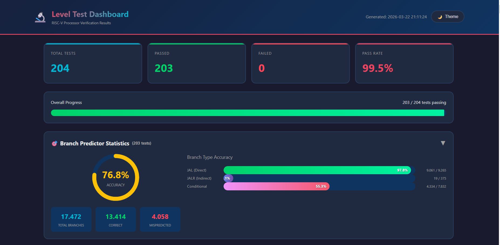
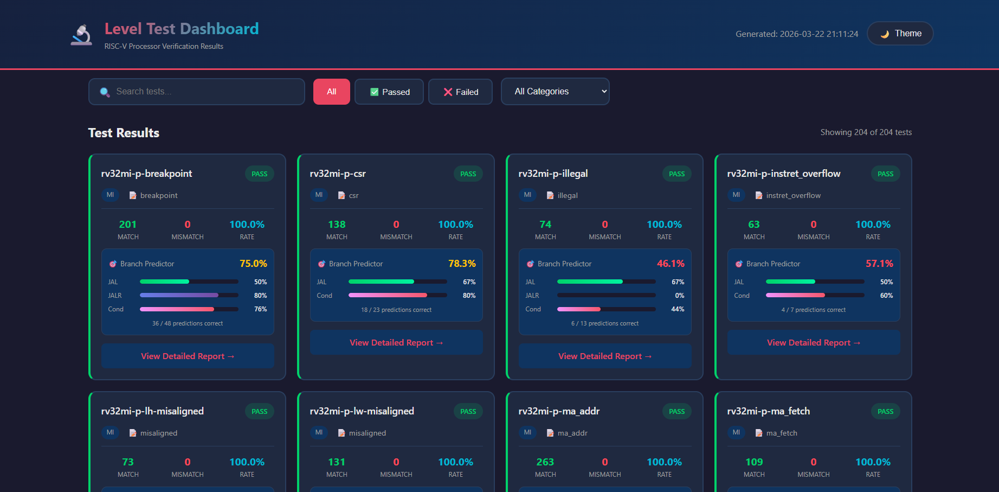
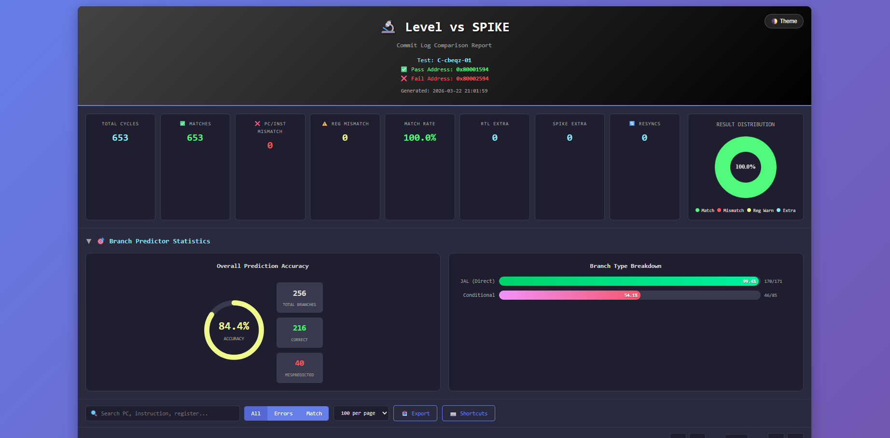
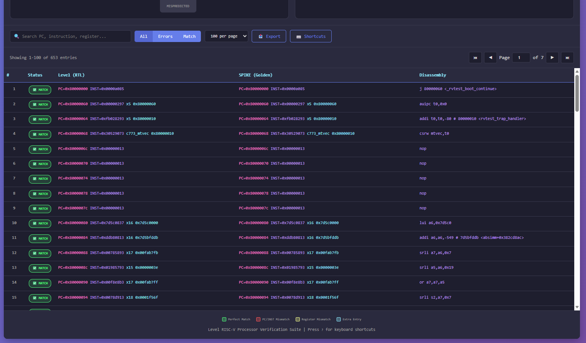
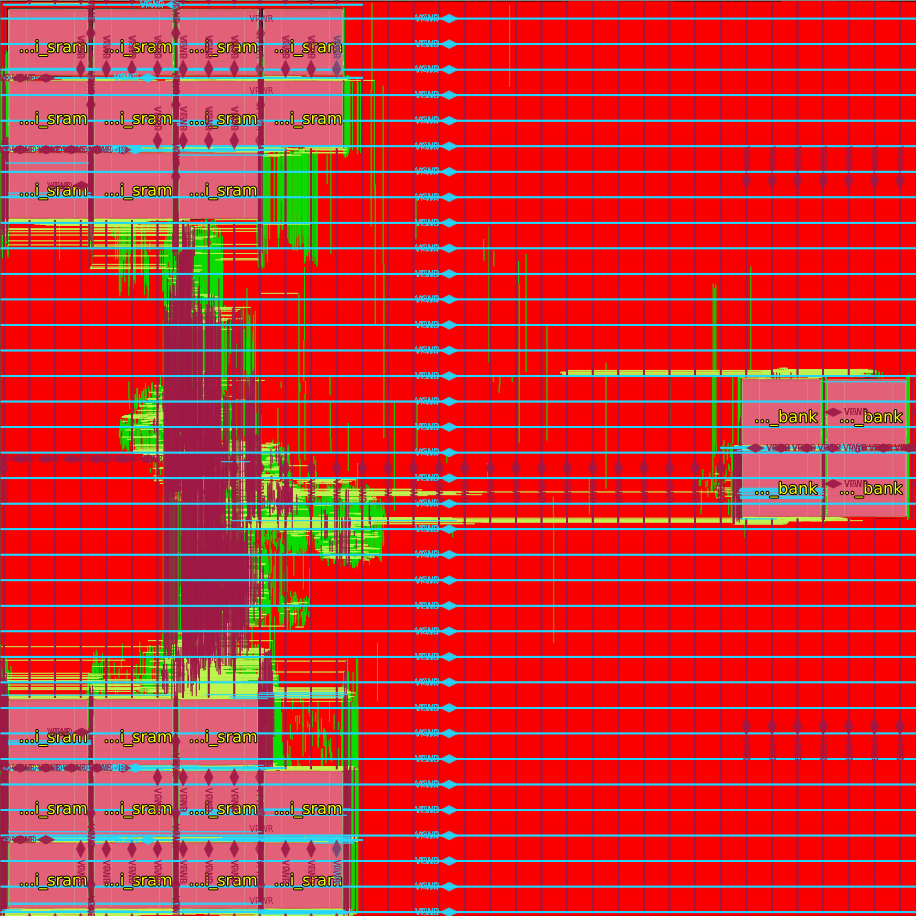

<p align="center">
  <!-- Ana Özellik Rozetleri -->
  
  
  
  
  <br/><br/>

  <!-- Performans ve Durum Rozetleri (Öne Çıkarıldı) -->
  
  
  
  <br/><br/>

  <!-- Bağlantı Rozetleri -->
  <a href="https://kerimturak.github.io/level-v/">
    
  </a>
  <a href="https://github.com/kerimturak/level-v">
    
  </a>
  <a href="https://github.com/kerimturak/level-v/actions">
    
  </a>
</p>

<!-- Proje Başlığı ve Kısa Açıklama -->
<p align="center">
  
  <span style="font-size: 48px; font-weight: bold; vertical-align: middle; margin-left: 15px;">Level RISC-V</span>
</p>
<p align="center">
  <strong>Open-source, 5-stage in-order, RV32IMC RISC-V processor core.</strong><br>
  Built for <strong>simulation, verification, and SoC experiments</strong> with a comprehensive toolchain.
</p>


Normalized bars use `1.00` as a fixed visual baseline for fast scanning. Detailed methodology, raw counters, and reproduction commands stay in [Benchmark scores](#benchmark-scores).

## Why Level-V?

- It is not a minimal core: the front-end includes RV32C handling, an align buffer, branch prediction, and cache-backed fetch.
- It is built for verification work: Spike comparison, riscv-tests, riscv-arch-test, Imperas flows, and optional riscv-dv / formal hooks are already integrated.
- It is parameterized for experiments: prefetch mode, cache hierarchy, multiplier/divider implementation, and simulation profiles are all configurable.
- It is easy to inspect: commit traces, Konata exports, dashboards, and memory-size reports are first-class workflows.

---

## Highlights

| Area | What you get |
|------|----------------|
| **ISA** | RV32I + M + C, Zicsr, Zifencei, machine mode |
| **Frontend** | Align buffer, RV32C decode, tournament branch predictor (GShare + bimodal), BTB, RAS, optional **next-line prefetch** (`PREFETCH_TYPE` in `level_param.sv`) |
| **Memory** | **L1** I$/D$ + PMA; optional **L2** — non-blocking, **dual-pipe** (I & D), **multi-bank**, write-back, MSHR, MESI-style tags (`USE_L2_CACHE=1`) |
| **Execute** | ALU, CSR file, selectable multiply/divide implementations |
| **Verify** | riscv-tests, riscv-arch-test, Imperas flows, Spike trace compare, optional formal / RISC-V DV |
| **Observability** | Spike-style commit trace, Konata pipeline export, **HTML test dashboard** (`make dashboard`) |

## Architecture at a glance

<p align="center">
  <a href="https://htmlpreview.github.io/?https://github.com/kerimturak/level-v/blob/main/level_riscv_architecture.html">
    
  </a>
</p>

> Click the badge above to open the **live interactive architecture diagram** in your browser (via htmlpreview.github.io).
> Tabs: Pipeline · Cache &amp; MMU · SoC &amp; Peripherals · Branch Predictor · Memory Map

<p align="center">
  
</p>

<p align="center">
  <a href="https://htmlpreview.github.io/?https://github.com/kerimturak/level-v/blob/main/docs/level_riscv_core_diagram.html">
    
  </a>
</p>

> **SoC / pipeline / memory / Wishbone / benchmarks:** styled one-pager in [`docs/level_riscv_core_diagram.html`](docs/level_riscv_core_diagram.html) (open locally or use the badge via [htmlpreview.github.io](https://htmlpreview.github.io/)). GitHub’s README renderer does not apply custom CSS, so this replaces the old static `mcu_diagram.png` slide.

### Memory hierarchy (detail)

| Block | Role |
|--------|------|
| **L1 I$ / D$** | Blocking line fills toward L2 or main memory; sizes and associativity from `rtl/pkg/level_param.sv`. |
| **L2 `nbmbmp_l2_cache`** | *Non-blocking, multi-bank, multi-port* cache: separate **I-pipe** and **D-pipe** FSMs, `dp_bram` arrays per way/bank, shared memory controller, inline **MSHR** for concurrent misses, write-back evictions to Wishbone. Turn on with **`USE_L2_CACHE=1`** for sim/synth defines. |
| **I-Cache Prefetch** | **`next_line_prefetcher`** + **`prefetcher_wrapper`** in the fetch path; arms the line after a demand miss. `PREFETCH_TYPE=1` to enable. |
| **D-Cache Prefetch** | Inline next-line prefetcher in **`memory.sv`**: on a D-cache load miss, the subsequent cache line is prefetched automatically (RAM region only, bit31=1). A stride prefetcher (`stride_prefetcher.sv`, RPT 64-entry) exists but is currently disabled — planned for a future release. |

### Test dashboard

After runs under `results/logs/<sim>/`, **`make dashboard`** builds a browsable HTML report for:

- ISA, benchmark, and regression-family grouping
- pass/fail summaries plus Spike diff drill-down
- quick navigation from failing runs into logs and artifacts

Illustrative preview:

<p align="center">
  
  
  
  
  <br/>
  <sub>Stylized preview — open the generated <code>index.html</code> after <code>make dashboard</code> for live data.</sub>
</p>

---

## Open-source tool stack

Tools this repo integrates with day to day. Click a badge to open the upstream project where applicable.

<table>
  <thead>
    <tr>
      <th width="200"></th>
      <th>Tool</th>
      <th>Role in Level</th>
    </tr>
  </thead>
  <tbody>
    <tr>
      <td align="center"><a href="https://en.wikipedia.org/wiki/RISC-V"></a></td>
      <td><strong>RISC-V ISA</strong></td>
      <td>Instruction set & compliance references</td>
    </tr>
    <tr>
      <td align="center"><a href="https://verilator.org"></a></td>
      <td><strong>Verilator</strong></td>
      <td>Primary fast RTL simulation (C++ model)</td>
    </tr>
    <tr>
      <td align="center"><a href="https://www.python.org/"></a></td>
      <td><strong>Python 3</strong></td>
      <td>Test runner, ELF/MEM helpers, dashboards, config tooling</td>
    </tr>
    <tr>
      <td align="center"></td>
      <td><strong>GNU Make</strong></td>
      <td>Single root <code>makefile</code> orchestrates sim, tests, synth helpers</td>
    </tr>
    <tr>
      <td align="center"></td>
      <td><strong>RISC-V GCC</strong> <code>riscv32-unknown-elf-</code></td>
      <td>Compiles ISA / benchmark / custom C tests</td>
    </tr>
    <tr>
      <td align="center"><a href="https://github.com/riscv-software-src/riscv-isa-sim"></a></td>
      <td><strong>Spike</strong></td>
      <td>Golden reference for commit-trace comparison</td>
    </tr>
    <tr>
      <td align="center"><a href="https://yosyshq.net/yosys/"></a></td>
      <td><strong>Yosys</strong></td>
      <td>Lint / synthesis / structural checks (<code>make yosys</code>, <code>make lint</code>)</td>
    </tr>
    <tr>
      <td align="center"></td>
      <td><strong>ModelSim / Questa</strong></td>
      <td>Optional event-driven sim + GUI waves</td>
    </tr>
    <tr>
      <td align="center"><a href="https://gtkwave.sourceforge.net/"></a></td>
      <td><strong>GTKWave / Surfer</strong></td>
      <td>View FST/VCD from Verilator or ModelSim</td>
    </tr>
    <tr>
      <td align="center"><a href="https://github.com/shioyadan/Konata"></a></td>
      <td><strong>Konata</strong></td>
      <td>Pipeline trace viewer (Konata logger in RTL)</td>
    </tr>
    <tr>
      <td align="center"><a href="https://github.com/chipsalliance/riscv-dv"></a></td>
      <td><strong>riscv-dv</strong></td>
      <td>Optional random ISA stimulus (<code>make riscv_dv_*</code>)</td>
    </tr>
    <tr>
      <td align="center"><a href="https://github.com/SymbioticEDA/riscv-formal"></a></td>
      <td><strong>riscv-formal</strong></td>
      <td>Optional bounded / formal checks (<code>make formal*</code>)</td>
    </tr>
  </tbody>
</table>

---

## Quick start

**Prerequisites:** Verilator 5+, RISC-V GCC (`riscv32-unknown-elf-*`), Python 3.8+, GNU Make. Optional: Spike, Yosys, ModelSim, GTKWave/Surfer.

```bash
git clone https://github.com/kerimturak/level-v.git
cd level-v

# Build the Verilator model
make verilate

# One-shot: fetch + build + import Berkeley ISA tests (needs subrepo / toolchain)
make isa_auto

# Run one test (RTL + Spike compare by default)
make run T=rv32ui-p-add

# Run the ISA regression suite
make isa

# Help
make help
```

**Useful shortcuts:** `make t T=<isa-test>`, `make run T=<name>`, `make quick_test T=<name>` (RTL only). See `make help_tests` and `make help_sim`.

---

## Repository layout (short)

```
├── rtl/                 # Core, MMU/cache, peripherals, wrappers, pkg, flist.f
├── sim/                 # C++ TB, test lists, custom C tests
├── env/                 # Per-test link scripts & runtime for each suite
├── script/              # Python tools, shell helpers, JSON/.conf profiles
├── subrepo/             # riscv-tests, arch-test, Imperas, CoreMark, Embench, BEEBS, …
├── docs/                # Deep-dive markdown + MkDocs site source
├── makefile             # Single entry point for sim, tests, synth helpers
└── results/             # Logs, waves, dashboards (generated)
```

---

## Common Make targets

| Target | What it does |
|--------|----------------|
| `make verilate` | Compile RTL → `build/obj_dir/Vlevel_wrapper` |
| `make verilate-fast` | Same as `make verilate VERILATE_FAST=1` (dev skip heuristic) |
| `make run T=<test>` | Full flow: prep → RTL → Spike → compare (see `USE_PYTHON`) |
| `make isa` / `make arch` / `make imperas` | Batch suites (requires imported ELFs under `build/tests/`) |
| `make isa_auto` / `make arch_auto` | Clone/configure/build/import pipelines |
| `make run_coremark` | CoreMark path (see `docs/COREMARK_QUICK_START.md`) |
| `make lint` | Verilator `--lint-only` pass |
| `make dashboard` | HTML summary over `results/logs/<sim>/` |
| `make clean` | Clears build artifacts; keeps `build/tests/` by default |
| `make clean_nuclear` | Deletes all of `build/` including compiled tests |
| `make levelv_memory_report` | Prints `riscv32-unknown-elf-size` for every `build/tests/**/*.elf` plus per-suite `max(dec)` |
| `make custom_build TEST=<name>` | Bare-metal demo C tests → `build/tests/custom/<name>.mem` (UART; see `sim/test/custom/`) |
| `make beebs_clone` / `make beebs_build` | Git submodule `subrepo/beebs` (GPL-3.0); `beebs_build` runs native `./configure && make`. RV32 `.mem` still needs a chip/board port (`env/beebs/README.md`) |

**Configuration:** simulator JSON under `script/config/verilator.json` & `modelsim.json`; simulation profile keys in `script/config/tests/*.conf` (merged with `default.conf`). Override with `TEST_CONFIG=...`, `MAX_CYCLES=...`, etc.

---

## Static program memory (linker image size)

For **on-chip RAM** sizing and `env/*/link.ld` `LENGTH`, the relevant figure is the **`dec`** column from `riscv32-unknown-elf-size` (text + data + bss), which includes heap/stack reservations when the linker script places them in the image (e.g. CoreMark `.heap` / `.stack` `NOLOAD` regions).

Refresh numbers any time after (re)building tests:

```bash
make levelv_memory_report
```

### Per-suite ceiling (`max(dec)` in a typical tree)

These are **upper bounds per suite** — individual tests can be smaller. **riscv-arch-test** images are aimed at simulation / compliance flows and can be **hundreds of KiB**; they are not representative of small FPGA BRAM.

| Suite | Typical `max(dec)` | ~KiB | Notes |
|-------|-------------------:|-----:|-------|
| **torture** | 5988 | ~5.9 | Small randomized fragments |
| **imperas** | 13028 | ~12.7 | |
| **riscv-dv** | 13432 | ~13.1 | |
| **dhrystone** | 19860 | ~19.4 | `env/dhrystone/link.ld` RAM **20 KiB** |
| **coremark** | 30556 | ~29.8 | `env/coremark/levelv/link.ld` **32 KiB** ceiling |
| **embench-IoT** | 39928 | ~39.0 | `env/embench/link.ld` **40 KiB** LENGTH, **16 KiB** stack (largest: **qrduino**); RTL `WRAPPER_RAM_SIZE_KB` must match |
| **riscv-arch-test** | often much larger than 32 KiB | — | Use `levelv_memory_report` for exact ELFs |

### Embench-IoT (each benchmark, static `dec`)

Sorted by name (one row per `.elf` under `build/tests/embench/elf/` after `make embench_build`):

| Benchmark | `dec` (bytes) | ~KiB |
|-----------|---------------:|-----:|
| aha-mont64 | 23170 | 22.63 |
| crc32 | 22717 | 22.19 |
| edn | 26193 | 25.58 |
| huffbench | 32798 | 32.03 |
| matmult-int | 31695 | 30.95 |
| md5sum | 26075 | 25.46 |
| nettle-aes | 35699 | 34.86 |
| nettle-sha256 | 27363 | 26.72 |
| nsichneu | 37069 | 36.20 |
| picojpeg | 35669 | 34.83 |
| qrduino | 39928 | 38.99 |
| sglib-combined | 33649 | 32.86 |
| slre | 24990 | 24.40 |
| statemate | 25757 | 25.15 |
| tarfind | 31019 | 30.29 |

**UART / `.mem` note:** `.mem` file **line count** is driven by the binary image (+ optional padding, e.g. `COREMARK_MEM_PAD_BYTES` in the makefile). Smaller linker images yield smaller `.mem` files for FPGA programming.

---

## Documentation

**Site:** [kerimturak.github.io/level-v](https://kerimturak.github.io/level-v/) — architecture, tools, sim guides, cache tuning, exception priority, Wishbone, and more.

**Local:** `mkdocs serve` if you use MkDocs, or browse `docs/` directly. Highlights:

| Topic | Entry |
|--------|--------|
| Architecture | [docs/architecture.md](docs/architecture.md) |
| Tools | [docs/tools.md](docs/tools.md) |
| Simulation overview | [docs/sim/overview.md](docs/sim/overview.md) |
| CoreMark | [docs/COREMARK_QUICK_START.md](docs/COREMARK_QUICK_START.md) |
| Performance logging | [docs/PERF_PIPELINE_LOG.md](docs/PERF_PIPELINE_LOG.md) |

---

## ASIC / OpenLane

OpenLane flow assets live under `asic/openlane/`. Example GDS snapshot:

<p align="center">
  
</p>

---

## Benchmark scores

Results below are from Verilator RTL simulation at `CPU_CLK_HZ=25_000_000`. If you want an apples-to-apples comparison against another core, keep the workload, ISA/ABI, clock, linker constraints, and compiler flags identical. Both runs use the repo's `riscv32-unknown-elf-gcc` toolchain; the CoreMark UART banner reported `GCC15.1.0`.

| Benchmark | Workload | Verilator / RTL sim | FPGA (target board) | Toolchain + optimization flags | Notes |
| --------- | -------- | ------------------- | ------------------- | ------------------------------ | ----- |
| CoreMark | 10 iterations | **2.62 CoreMark/MHz**<br>**65.38 CoreMarks @ 25 MHz**<br>3,824,420 ticks | — | `riscv32-unknown-elf-gcc`<br>`-O2 -g -march=rv32imc_zicsr -mabi=ilp32 -fno-builtin -fno-common -nostdlib -nostartfiles -DPERFORMANCE_RUN=1 -DITERATIONS=10 -lm -lgcc` | Quick comparison run. Runtime is under 10 s, so this is useful for relative comparison but not an official EEMBC-valid CoreMark publication score. |
| Dhrystone 2.1 | 200 iterations | **~66,112 Dhrystones/s**<br>**1.51 DMIPS/MHz**<br>**~37.63 DMIPS @ 25 MHz**<br>75,629 total cycles | — | `riscv32-unknown-elf-gcc`<br>`-O3 -march=rv32imc_zicsr -mabi=ilp32 -fno-inline -funroll-loops -static -nostdlib -nostartfiles -DTIME -DDHRY_ITERS=200 -Wl,--gc-sections` | Verilator RTL sim at 25 MHz equivalent clock; ~378.15 cycles/iter; UART output reached `Dhrystone Complete`. |
| Embench-IoT | suite geomean | — | — | varies by benchmark | Use host-side geomean over per-benchmark metrics; keep linker/RAM settings fixed when comparing. |

### Reproduction details

| Item | CoreMark | Dhrystone |
| ---- | -------- | --------- |
| Source | `subrepo/coremark` | `env/dhrystone` |
| Build command | `make coremark COREMARK_ITERATIONS=10` | `make dhrystone DHRY_ITERS=200` |
| Run command | `make run_coremark COREMARK_ITERATIONS=10 SIM_UART_MONITOR=1 MAX_CYCLES=10000000` | `make dhrystone_run DHRY_ITERS=200 SIM_UART_MONITOR=1 MAX_CYCLES=5000000` |
| ISA / ABI | `-march=rv32imc_zicsr -mabi=ilp32` | `-march=rv32imc_zicsr -mabi=ilp32` |
| Clock define | `-DCPU_CLK_HZ=25000000UL` | `-DCPU_CLK_HZ=25000000UL` |
| Raw counter | `total_ticks = 3,824,420` | `total_cycles = 75,629` |
| Score formula | `CoreMark/MHz = iterations * 1e6 / total_ticks` | `Dhrystones/s = iterations * Fclk / total_cycles`<br>`DMIPS/MHz = (Dhrystones/s / 1757) / Fclk_MHz` |

---

## Contributing

1. Fork and branch from `main`.
2. Match RTL style: one module per file, `level_param` parameters, consistent `*_i` / `*_o` suffixes.
3. Run `make lint` before opening a PR.

---

## License

**GPLv3** — see [LICENSE](LICENSE).

---

## Author

**Kerim Turak**

<p align="center"><i>Level — a documented RV32IMC core for simulation, verification, and SoC experiments.</i></p>
